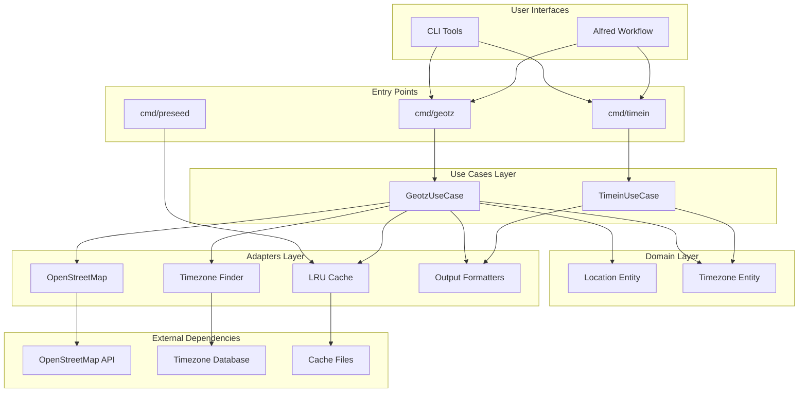
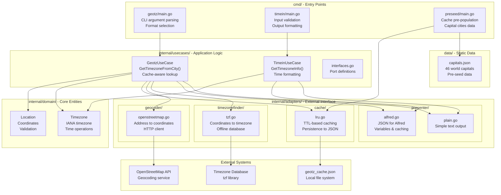
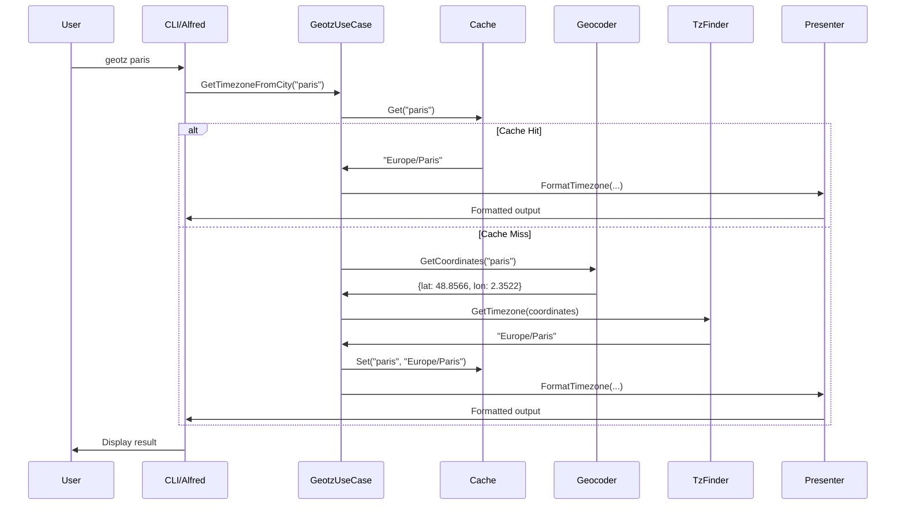
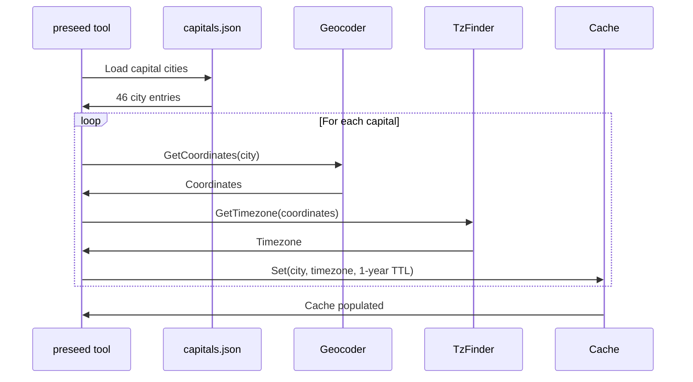
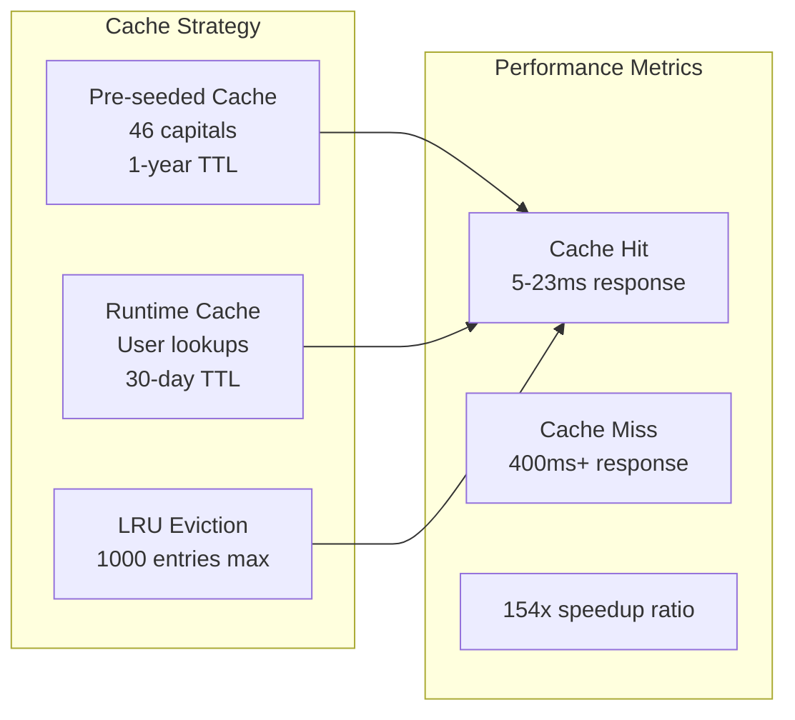
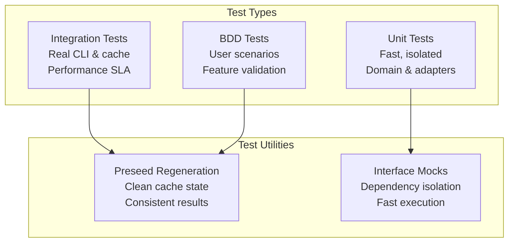

# alfred-timein Architecture

This document describes the Clean Architecture implementation of the alfred-timein project.

## High-Level Architecture



## Detailed Component Architecture



## Data Flow Diagrams

### Timezone Lookup Flow



### Cache Pre-seeding Flow



## Key Design Principles

### Clean Architecture Layers

1. **Domain Layer** (`internal/domain/`)
   - Core business entities (Location, Timezone)
   - No external dependencies
   - Pure business logic

2. **Use Cases Layer** (`internal/usecases/`)
   - Application-specific business rules
   - Orchestrates domain entities and adapters
   - Defines interfaces for external dependencies

3. **Adapters Layer** (`internal/adapters/`)
   - Implements external interfaces
   - Handles I/O operations
   - Converts between external and internal formats

4. **Frameworks Layer** (`cmd/`)
   - Entry points and CLI parsing
   - Framework-specific code
   - Dependency injection

### Performance Optimizations



### Testing Architecture



## File Organization

```text
alfred-timein/
├── cmd/                    # Entry points
│   ├── geotz/             # Timezone lookup CLI
│   ├── timein/            # Time display CLI
│   └── preseed/           # Cache pre-population
├── internal/              # Private application code
│   ├── domain/            # Core business entities
│   ├── usecases/          # Application business rules
│   └── adapters/          # External system interfaces
│       ├── cache/         # LRU cache with persistence
│       ├── geocoder/      # Address to coordinates
│       ├── timezonefinder/# Coordinates to timezone
│       └── presenter/     # Output formatting
├── data/                  # Static data files
├── features/              # BDD test scenarios
├── workflow/              # Alfred workflow assets
└── docs/                  # Documentation
```

This architecture provides:

- **Separation of Concerns**: Each layer has distinct responsibilities
- **Testability**: Interfaces enable easy mocking and testing
- **Performance**: Intelligent caching with pre-seeding
- **Maintainability**: Clear boundaries and minimal coupling
- **Extensibility**: New adapters can be added without changing core logic
